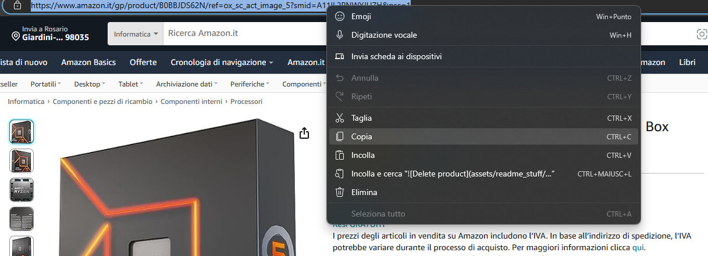
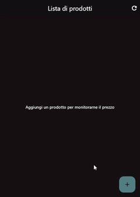
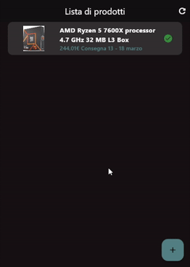
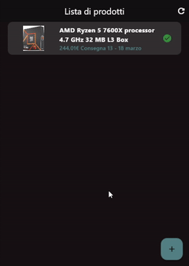

# Amazon Price Tracker

This project aims to simplify and speed up the price monitoring for amazon goods you need.

## Getting Started

To add a product to the app follow this simple tutorial:

#### Once you launched the app click on the "+" button on the bottom right side and a dialog will pop up, insert the amazon product url in this dialog and hit "Aggiungi".

#### You can see product details by clicking on it. You can also refresh the list by clicking on the circle arrow top right side

#### You can remove a product by sliding it to the left and clicking on the red button with trash bin icon

